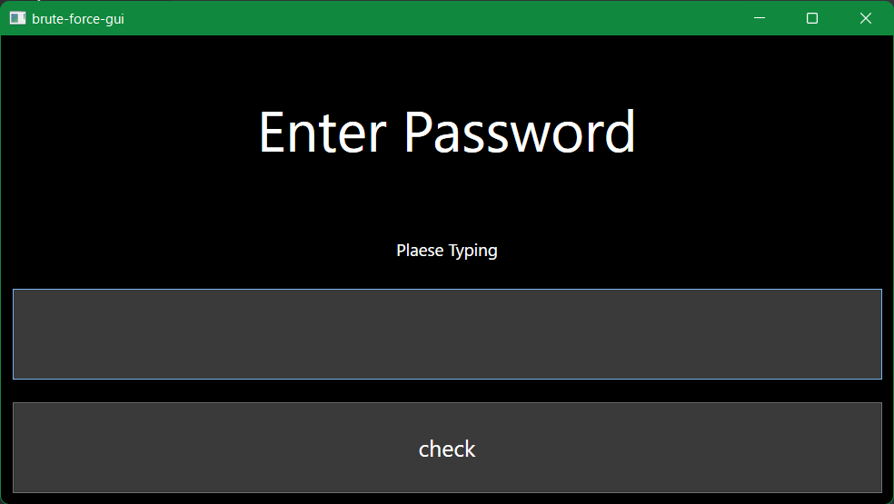
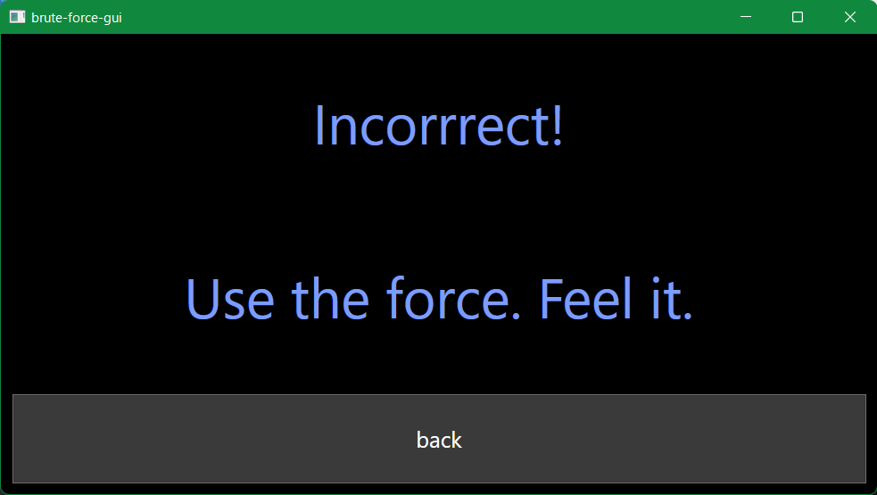
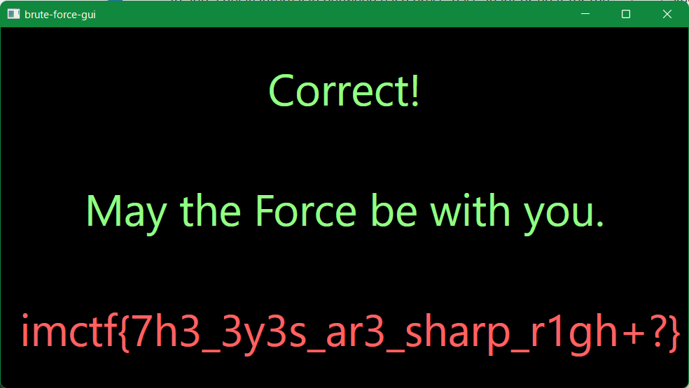

# Readme

## 問題名

brute force gui

## 分野

misc

## 難易度

hard

## 内容

ブルートフォースで解くか、リバースエンジニアリングで解くか迷う問題

## 問題文

R2 は最高のアストロメク・ドロイドだと思うかい？彼はC3にクイズを出したらしい。「パスワードが分かるか？600万言語以上話せる私に不可能などあるものですか！」

[quiz](./dist/brute-force-gui.zip)

## フラグ

`imctf{7h3_3y3s_ar3_sharp_r1gh+?}`

## ヒント

1. RPA or R2?
1. Appium or PyAutoGui?
1. rabin2 or radare2 or ghidra or john?

## Writeup

1. 配布されたzipを解凍すると、`WpfApp1.exe`が出てくる。
1. Linuxにて`file`コマンドでチェックすると、Windowsの実行形式ファイルであることが分かる。

    ```sh
    > file WpfApp1.exe
    WpfApp1.exe: PE32+ executable (GUI) x86-64, for MS Windows
    ```

1. Windows11で起動してみると、パスワード入力画面が出てくる。

    

1. 入力フォームに適当に入力してみると、２桁の数字がパスワードであることが分かる。

    

1. `check`ボタンを押すと間違っていることが分かる。フォースを使えばいいらしい。

    

1. ということで、`writeup.py`を作成。

    ```py
    import time
    import pyautogui

    for item in range(5):
        time.sleep(1)
        print(item)

    for item in range(0,100):
        
        pyautogui.keyDown('tab')
        pyautogui.keyDown('tab')
        for charindex in range(len(str(item))):
            pyautogui.keyDown(str(item)[charindex])
        pyautogui.keyDown('tab')
        pyautogui.press('space')
        time.sleep(0.5)
        pyautogui.keyDown('tab')
        pyautogui.keyDown('tab')
        pyautogui.press('space')
        time.sleep(0.5)
    ```

    スクリプトの内容

    - 5秒間カウントダウンします。この間に、キーボード入力のフォーカスを課題アプリに移します。
    - キー操作でブルートフォースを実行。

1. 実行して、`99`を入力したところででフラグが取れる。

    

## 注意

[.NET 6](https://dotnet.microsoft.com/en-us/download)がインストールされているWindows11が推奨解答環境です。
