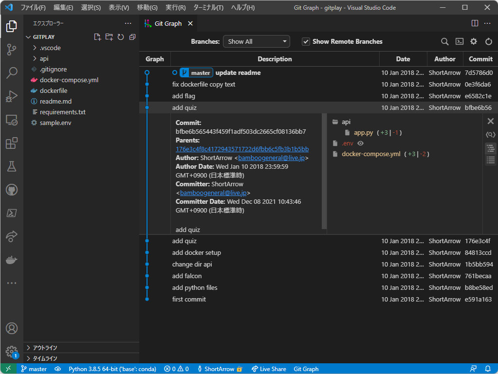

# Readme

## 問題名

I wanna present

## 分野

misc

## 難易度

normal

## 内容

gitの履歴からパスワードが見つかる問題

## 問題文

今夜はクリスマスイブ。ちゃんと貰えるように下準備をしておこう。いい子にしていたら貰えるって！ちゃんと準備が出来る子だもん。

[仕掛け](./dist/gitplay.zip)
[仕掛けた場所](104.196.236.136:12025)

## フラグ

`imctf{Jin913_A11_7h3_Way}`

## ヒント

1. you are Santa Claus, right?

## 作問

このフォルダ内で、下記コマンドを実行。compose V2 が前提条件。

```bash
sudo docker compose up -d --build
```

## Writeup

1. `104.196.236.136:12025`というアドレスと、[zipファイル](./dist/gitplay.zip)が配布されます。
1. 配布zipファイルを解凍すると Docker Compose であることが判明。
1. `docker-compose.yml`の8行目を見ると、`command: "python -m gunicorn api.app:app --bind 0.0.0.0:8000 --reload"`となっています。ここから、`gnicorn`を使ったwebサーバーの可能性を考えます。
1. webサイトのようなので、とりあえずcurlしてみます。

    ```bash
    > curl http://104.196.236.136:12025/
    please post present into big-sock!
    ```

1. 先ほどの curl から、`big-sock`に`POST`すれば良さそうだと分かります。
1. 同じく8行目の`api.app`との記述から、zipファイル内の`./api/app.py`を読んでみます。
1. すると、5~6行目に記述されている`on_get`関数が、先ほどの`curl`で得られた`please post present into big-sock!`を表示していることが分かります。
1. `on_post`関数を見てみると、`/big-sock`というアドレスに`post`するとフラグが得られそうです。また、`post`するデータはjsonで、キー`present`の値に`.env`ファイルの値が入っていれば良さそうです。
1. `gitplay.zip`というファイル名から、`git`履歴が怪しそうだと予想します。
1. vscodeの拡張機能で[Git Graph](https://marketplace.visualstudio.com/items?itemName=mhutchie.git-graph)などを使って調査してみます。すると、`add quiz`というコミットで、`.env`ファイルが見つかります。
    
1. `.env`を見てみると、`Talking_Turboman_Figure`と書いてあります。
1. `curl`で`post`してみます。

    ```bash
    > curl -X POST -H "application/json" -d '{"present":"Talking_Turboman_Figure"}' 104.196.236.136:12025/big-sock
    correct aW1jdGZ7SmluOTEzX0ExMV83aDNfV2F5fQ==
    ```

1. 無事にcorrectと表示されました。
1. まだ暗号化されているようです。
1. 末尾に`==`が付いているので、Base64と予想して復号してみます。
1. フラグ形式になりました。

    ```bash
    imctf{Jin913_A11_7h3_Way}
    ```
