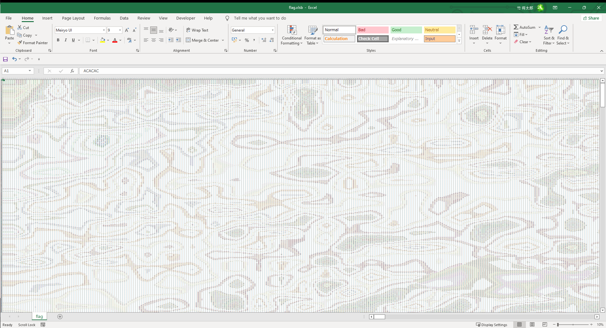

# Read me

## 問題名

pixcels equal cells

## 分野

misc?

## 難易度

normal

## 内容

フラグの画像がExcelに変換されて、セルとピクセルが１：１になっている問題。
セルの内容を基にしてピクセル操作で画像ファイルを生成すると解ける。

## 問題文

この世界には、どんなものでもExcelに変えてしまうという「神Excel師」なるものが存在するらしい。そいつは今夜、フラグが書かれた画像をExcelに変えてしまいやがった。なんてことだ！そこの君、なんとかして元に戻せないかな？

## フラグ

`imctf{google_pixel_six_pro}`

## Write Up

1. 問題で`flag.xlsb`が配布されている。開いてみると、重い。１セルを見てみるとRGBコードらしきものがある。

    

1. Excel形式をPython等で読み込むのは重いので、`*.csv`形式に変換して置く。
1. `./writeup/writeup.py` にcsvファイルを通すと画像が生成される。
1. 画像を見てみると、行書体でフラグが書かれている。

    
