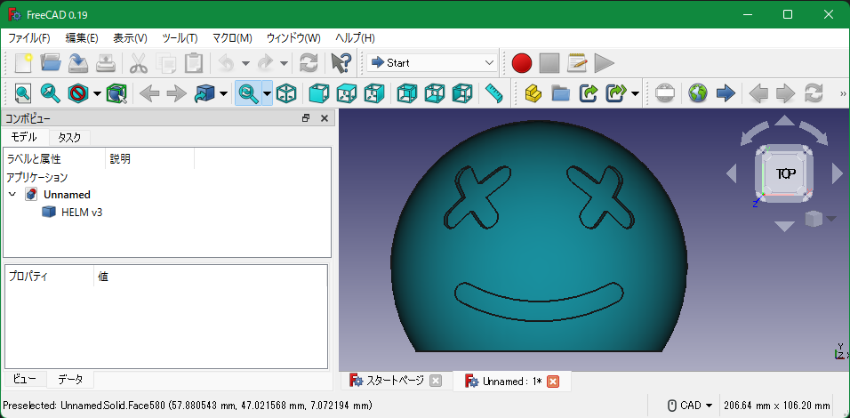

# whose is this

## 難易度

normal

## 問題文

ラボのPCに接続した。接続できたのはいいけれど、いったい誰のPCだろう。取り出せたデータから誰のPCか調べられないかな？

104.196.236.136:55555

## ヒント

1. I think `#` was replaced with html tags
1. what is the step

## フラグ

`imctf{marshmello_helm}`

## Writeup

1. netcat で接続したら大量にデータが流れてくるので、テキストにリダイレクトする。

```bash
    nc 104.196.236.136 55555 > res.txt
```

1. 中身を確認すると、途中でデータの内容が切り替わるタイミングがある。

1. 切り替わるところ`### change from here ###`と冒頭・末尾は不要なので捨てて、テキストファイルを２つ作る。

1. 前半の側の`<></>`というところを、順番に後半の`#\d+`で置き変える。

1. この時、例えば、[python スクリプト](./writeup_tools/decode.py)を使ってヒントを基に１ファイルに統合する。

1. 出来上がったテキストを`helmet.step`など、拡張子をstepにして保存。

1. [ISO 10303-21 - Wikipedia](https://en.wikipedia.org/wiki/ISO_10303-21)によれば、STEP ファイルはCADファイル。

1. [Freecad](https://www.freecadweb.org/)を使って表示してみる。

1. ヘルメットのCADデータであることが判明。

1. ヘルメットの中を覗くと、フラグがある。



## 作問

このフォルダ内で、下記コマンドを実行。compose V2 が前提条件。

```bash
sudo docker compose up -d --build
```
