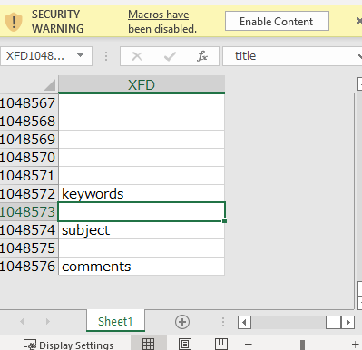
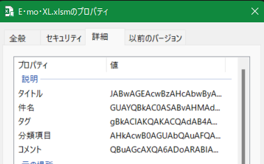

# Readme

## 問題名

e mo i xl

## 分野

rev

## 難易度

hard

## 内容

vbaの中身が難読化されたPowershellスクリプトを実行する。スクリプトの内容は、パスワードを入れるとflagをゲットできるもの。暗号化にはpowershellの起動オプション`-e`と、Excelのファイルプロパティを使う。

## 問題文

私はSudokuパズルの懸賞金ハンター。さらなるスピードを求めて、ツールを用意した。なに？君も使いたい？いいだろう。ただし、パスワードを当てられたらな。

[これ](./E・mo・XL.7z)がそのツールだ。

## ヒント

1. Do you like emotional song?
1. oletools
1. Need win or excel? That's not true.

## フラグ

`imctf{I_really_really_really_really_really_really_like_you}`

## Writeup

1. 配布ファイルを解凍して、VBEで見てみてもパスワードが掛かっており、解けない。
1. ヒントを見て [oletoolsのリポジトリ](https://github.com/decalage2/oletools) に行くと、olevbaがvbaの抽出コマンドだと分かる。
1. olevbaで見てみる。

    ```bash
    > olevba E・mo・XL.xlsm
    olevba 0.60 on Python 3.9.7 - http://decalage.info/python/oletools
    ===============================================================================
    FILE: E・mo・XL.xlsm
    Type: OpenXML
    WARNING  For now, VBA stomping cannot be detected for files in memory
    -------------------------------------------------------------------------------
    VBA MACRO ThisWorkbook.cls
    in file: xl/vbaProject.bin - OLE stream: 'VBA/ThisWorkbook'
    - - - - - - - - - - - - - - - - - - - - - - - - - - - - - - - - - - - - - - -
    Private Sub Workbook_Open()
        Module1.GetPayload
    End Sub
    -------------------------------------------------------------------------------
    VBA MACRO Sheet1.cls
    in file: xl/vbaProject.bin - OLE stream: 'VBA/Sheet1'
    - - - - - - - - - - - - - - - - - - - - - - - - - - - - - - - - - - - - - - -
    (empty macro)
    -------------------------------------------------------------------------------
    VBA MACRO Module1.bas
    in file: xl/vbaProject.bin - OLE stream: 'VBA/Module1'
    - - - - - - - - - - - - - - - - - - - - - - - - - - - - - - - - - - - - - - -
    Sub GetPayload()
        Dim payload As String: payload = vbNullString
        Dim ws As Worksheet
        Set ws = ThisWorkbook.Worksheets(1)
        With ThisWorkbook
            With .BuiltinDocumentProperties
                payload = payload + .Item(ws.Cells(1048573, 16384).Value)
                payload = payload + .Item(ws.Cells(1048574, 16384).Value)
                payload = payload + .Item(ws.Cells(1048572, 16384).Value)
                payload = payload + .Item(ws.Cells(1048575, 16384).Value)
                payload = payload + .Item(ws.Cells(1048576, 16384).Value)
            End With
        End With
        payload = _
        "p" & "w" & "s" & "h" & " " & "-" & "n" & "o" & _
        "p" & " " & "-" & "e" & _
        "p" & " " & "B" & "y" & _
        "p" & "a" & "s" & "s" & " " & "-" & "e" & " " + _
        payload
        CreateObject("WScript.Shell").Run payload
    End Sub

    +----------+--------------------+---------------------------------------------+
    |Type      |Keyword             |Description                                  |
    +----------+--------------------+---------------------------------------------+
    |AutoExec  |Workbook_Open       |Runs when the Excel Workbook is opened       |
    |Suspicious|Shell               |May run an executable file or a system       |
    |          |                    |command                                      |
    |Suspicious|WScript.Shell       |May run an executable file or a system       |
    |          |                    |command                                      |
    |Suspicious|Run                 |May run an executable file or a system       |
    |          |                    |command                                      |
    |Suspicious|CreateObject        |May create an OLE object                     |
    |Suspicious|Hex Strings         |Hex-encoded strings were detected, may be    |
    |          |                    |used to obfuscate strings (option --decode to|
    |          |                    |see all)                                     |
    +----------+--------------------+---------------------------------------------+
    ```

1. ファイルを開くきに`Workbook_Open()`が実行され、その時に`GetPayload()`が実行されるところまでは予想できる。
1. `ws.Cells(1048573, 16384).Value`のような部分が５つあり、シートのセルから読み取っていることが分かる。
1. 手動で見に行くと、文字列が格納されている。

    

    文字の色が白いという、地味な難読化が仕掛けてある。

1. `BuiltinDocumentProperties`という部分から、ファイルのプロパティに何か記載されていることが分かる。見に行くと怪しげな文字列がある。

    

1. `GetPayload()`で使っている順に怪しい文字列をつなげてみる。

    順番は、title,subject,keyword,category,commentらしい。

    ```bash
    JABwAGEAcwBzAHcAbwByAGQAIAA9ACAAKABSAGUAYQBkAC0ASABvAHMAdAAgACIAUABhAHMAcwB3AG8AcgBkACIAKQAKACQAdAB4AHQAIAA9ACAAWwBTAHkAcwB0AGUAbQAuAFQAZQB4AHQALgBFAG4AYwBvAGQAaQBuAGcAXQA6ADoARABlAGYAYQB1AGwAdAAuAEcAZQB0AFMAdAByAGkAbgBnACgACgAgACAAIAAgAFsAUwB5AHMAdABlAG0ALgBDAG8AbgB2AGUAcgB0AF0AOgA6AEYAcgBvAG0AQgBhAHMAZQA2ADQAUwB0AHIAaQBuAGcAKAAKACAAIAAgACAAIAAgACAAIAAoAAoAIAAgACAAIAAgACAAIAAgACAAIAAgACAAQAAoACIANQBhACIALAAgACIANQA2ACIALAAgACIAMwA5ACIALAAgACIANwA0ACIALAAgACIANgAyACIALAAgACIAMwAxACIALAAgACIAMwA5ACIALAAgACIAMwAwACIALAAgACIANgAxACIALAAgACIANQA3ACIALAAgACIAMwA5ACIALAAgACIANwA1ACIALAAgACIANQA4ACIALAAgACIAMwAyACIALAAgACIANABhACIALAAgACIAMwA1ACIALAAgACIANQA4ACIALAAgACIAMwAyACIALAAgACIANABlACIALAAgACIANgA4ACIALAAgACIANgAzACIALAAgACIANgBkACIALAAgACIANwA4ACIALAAgACIAMwA1ACIALAAgACIANQA4ACIALAAgACIAMwAzACIALAAgACIANABhACIALAAgACIANgA4ACIALAAgACIANQBhACIALAAgACIANQA2ACIALAAgACIAMwA5ACIALAAgACIANwAxACIALAAgACIANQBhACIALAAgACIANQA4ACIALAAgACIANAAyACIALAAgACIANwBhACIALAAgACIANQBhACIALAAgACIANQA3ACIALAAgACIAMwA0ACIALAAgACIAMwBkACIAKQAgAHwACgAgACAAIAAgACAAIAAgACAAIAAgACAAIABGAG8AcgBFAGEAYwBoAC0ATwBiAGoAZQBjAHQAIAB7ACAAWwBjAGgAYQByAF0AWwBiAHkAdABlAF0AIgAwAHgAJABfACIAIAB9AAoAIAAgACAAIAAgACAAIAAgACkAIAAtAGoAbwBpAG4AIAAiACIACgAgACAAIAAgACkACgApAAoAJAB0AHgAdAAyACAAPQAgAFsAUwB5AHMAdABlAG0ALgBUAGUAeAB0AC4ARQBuAGMAbwBkAGkAbgBnAF0AOgA6AEQAZQBmAGEAdQBsAHQALgBHAGUAdABTAHQAcgBpAG4AZwAoAAoAIAAgACAAIABbAFMAeQBzAHQAZQBtAC4AQwBvAG4AdgBlAHIAdABdADoAOgBGAHIAbwBtAEIAYQBzAGUANgA0AFMAdAByAGkAbgBnACgACgAgACAAIAAgACAAIAAgACAAKAAKACAAIAAgACAAIAAgACAAIAAgACAAIAAgAEAAKAAiADUAYQAiACwAIAAiADYAZAAiACwAIAAiADcAOAAiACwAIAAiADYAOAAiACwAIAAiADUAYQAiACwAIAAiADcAOQAiACwAIAAiADQAMQAiACwAIAAiADMANgAiACwAIAAiADQAOQAiACwAIAAiADQANwAiACwAIAAiADYAYwAiACwAIAAiADcANAAiACwAIAAiADUAOQAiACwAIAAiADMAMwAiACwAIAAiADUAMgAiACwAIAAiADYAZAAiACwAIAAiADYANQAiACwAIAAiADMAMAAiACwAIAAiADYAYwAiACwAIAAiADYANgAiACwAIAAiADYAMwAiACwAIAAiADYAZAAiACwAIAAiADUANgAiACwAIAAiADYAOAAiACwAIAAiADYAMgAiACwAIAAiADQANwAiACwAIAAiADcAOAAiACwAIAAiADMANQAiACwAIAAiADUAOAAiACwAIAAiADMAMwAiACwAIAAiADQAYQAiACwAIAAiADYAYwAiACwAIAAiADUAOQAiACwAIAAiADUANwAiACwAIAAiADcAOAAiACwAIAAiADcAMwAiACwAIAAiADYANQAiACwAIAAiADUANgAiACwAIAAiADMAOQAiACwAIAAiADcAOQAiACwAIAAiADUAYQAiACwAIAAiADUANwAiACwAIAAiADQANgAiACwAIAAiADcAMwAiACwAIAAiADYAMgAiACwAIAAiADQAOAAiACwAIAAiADYAYwAiACwAIAAiADYANgAiACwAIAAiADYAMwAiACwAIAAiADYAZAAiACwAIAAiADUANgAiACwAIAAiADYAOAAiACwAIAAiADYAMgAiACwAIAAiADQANwAiACwAIAAiADcAOAAiACwAIAAiADMANQAiACwAIAAiADUAOAAiACwAIAAiADMAMwAiACwAIAAiADQAYQAiACwAIAAiADYAYwAiACwAIAAiADUAOQAiACwAIAAiADUANwAiACwAIAAiADcAOAAiACwAIAAiADcAMwAiACwAIAAiADYANQAiACwAIAAiADUANgAiACwAIAAiADMAOQAiACwAIAAiADcAOQAiACwAIAAiADUAYQAiACwAIAAiADUANwAiACwAIAAiADQANgAiACwAIAAiADcAMwAiACwAIAAiADYAMgAiACwAIAAiADQAOAAiACwAIAAiADYAYwAiACwAIAAiADYANgAiACwAIAAiADYAMgAiACwAIAAiADQANwAiACwAIAAiADYAYwAiACwAIAAiADcAMgAiACwAIAAiADUAYQAiACwAIAAiADUANgAiACwAIAAiADMAOQAiACwAIAAiADMANQAiACwAIAAiADYAMgAiACwAIAAiADMAMwAiACwAIAAiADUANgAiACwAIAAiADMAOQAiACkAIAB8AAoAIAAgACAAIAAgACAAIAAgACAAIAAgACAARgBvAHIARQBhAGMAaAAtAE8AYgBqAGUAYwB0ACAAewAgAFsAYwBoAGEAcgBdAFsAYgB5AHQAZQBdACIAMAB4ACQAXwAiACAAfQAKACAAIAAgACAAIAAgACAAIAApACAALQBqAG8AaQBuACAAIgAiAAoAIAAgACAAIAApAAoAKQAKACQAaQBzAFAAYQBzAHMAZQBkACAAPQAgACgAJABwAGEAcwBzAHcAbwByAGQAIAAtAGUAcQAgACQAdAB4AHQAKQAKAFcAcgBpAHQAZQAtAEgAbwBzAHQAIAAoACQAaQBzAFAAYQBzAHMAZQBkACAAPwAgACIAZwBvAG8AZAAgAHkAbwB1ACAAYQByAGUAIABwAGEAcwBzAGUAZAAiACAAOgAgACIAaQBuAGMAbwByAHIAZQBjAHQAIABwAGEAcwBzAHcAbwByAGQAIgApACAALQBGAG8AcgBlAGcAcgBvAHUAbgBkAEMAbwBsAG8AcgAgACgAJABpAHMAUABhAHMAcwBlAGQAIAA/ACAAIgBHAHIAZQBlAG4AIgAgADoAIAAiAFIAZQBkACIAKQAKAGkAZgAgACgAJABpAHMAUABhAHMAcwBlAGQAKQAgAHsACgAgACAAIAAgAFcAcgBpAHQAZQAtAEgAbwBzAHQAIAAkAHQAeAB0ADIAIAAtAEYAbwByAGUAZwByAG8AdQBuAGQAQwBvAGwAbwByACAAQgBsAHUAZQAKAH0ACgAkAGgAbwBzAHQALgBVAEkALgBSAGEAdwBVAEkALgBSAGUAYQBkAEsAZQB5ACgAKQAgAHwAIABPAHUAdAAtAE4AdQBsAGwACgA=
    ```

1. 末尾にbase64とあるのでBase64ということが予想される。

    ```bash
    $.p.a.s.s.w.o.r.d. .=. .(.R.e.a.d.-.H.o.s.t. .".P.a.s.s.w.o.r.d.".).
    .$.t.x.t. .=. .[.S.y.s.t.e.m...T.e.x.t...E.n.c.o.d.i.n.g.].:.:.D.e.f.a.u.l.t...G.e.t.S.t.r.i.n.g.(.
    . . . . .[.S.y.s.t.e.m...C.o.n.v.e.r.t.].:.:.F.r.o.m.B.a.s.e.6.4.S.t.r.i.n.g.(.
    . . . . . . . . .(.
    . . . . . . . . . . . . .@.(.".5.a.".,. .".5.6.".,. .".3.9.".,. .".7.4.".,. .".6.2.".,. .".3.1.".,. .".3.9.".,. .".3.0.".,. .".6.1.".,. .".5.7.".,. .".3.9.".,. .".7.5.".,. .".5.8.".,. .".3.2.".,. .".4.a.".,. .".3.5.".,. .".5.8.".,. .".3.2.".,. .".4.e.".,. .".6.8.".,. .".6.3.".,. .".6.d.".,. .".7.8.".,. .".3.5.".,. .".5.8.".,. .".3.3.".,. .".4.a.".,. .".6.8.".,. .".5.a.".,. .".5.6.".,. .".3.9.".,. .".7.1.".,. .".5.a.".,. .".5.8.".,. .".4.2.".,. .".7.a.".,. .".5.a.".,. .".5.7.".,. .".3.4.".,. .".3.d.".). .|.
    . . . . . . . . . . . . .F.o.r.E.a.c.h.-.O.b.j.e.c.t. .{. .[.c.h.a.r.].[.b.y.t.e.].".0.x.$._.". .}.
    . . . . . . . . .). .-.j.o.i.n. .".".
    . . . . .).
    .).
    .$.t.x.t.2. .=. .[.S.y.s.t.e.m...T.e.x.t...E.n.c.o.d.i.n.g.].:.:.D.e.f.a.u.l.t...G.e.t.S.t.r.i.n.g.(.
    . . . . .[.S.y.s.t.e.m...C.o.n.v.e.r.t.].:.:.F.r.o.m.B.a.s.e.6.4.S.t.r.i.n.g.(.
    . . . . . . . . .(.
    . . . . . . . . . . . . .@.(.".5.a.".,. .".6.d.".,. .".7.8.".,. .".6.8.".,. .".5.a.".,. .".7.9.".,. .".4.1.".,. .".3.6.".,. .".4.9.".,. .".4.7.".,. .".6.c.".,. .".7.4.".,. .".5.9.".,. .".3.3.".,. .".5.2.".,. .".6.d.".,. .".6.5.".,. .".3.0.".,. .".6.c.".,. .".6.6.".,. .".6.3.".,. .".6.d.".,. .".5.6.".,. .".6.8.".,. .".6.2.".,. .".4.7.".,. .".7.8.".,. .".3.5.".,. .".5.8.".,. .".3.3.".,. .".4.a.".,. .".6.c.".,. .".5.9.".,. .".5.7.".,. .".7.8.".,. .".7.3.".,. .".6.5.".,. .".5.6.".,. .".3.9.".,. .".7.9.".,. .".5.a.".,. .".5.7.".,. .".4.6.".,. .".7.3.".,. .".6.2.".,. .".4.8.".,. .".6.c.".,. .".6.6.".,. .".6.3.".,. .".6.d.".,. .".5.6.".,. .".6.8.".,. .".6.2.".,. .".4.7.".,. .".7.8.".,. .".3.5.".,. .".5.8.".,. .".3.3.".,. .".4.a.".,. .".6.c.".,. .".5.9.".,. .".5.7.".,. .".7.8.".,. .".7.3.".,. .".6.5.".,. .".5.6.".,. .".3.9.".,. .".7.9.".,. .".5.a.".,. .".5.7.".,. .".4.6.".,. .".7.3.".,. .".6.2.".,. .".4.8.".,. .".6.c.".,. .".6.6.".,. .".6.2.".,. .".4.7.".,. .".6.c.".,. .".7.2.".,. .".5.a.".,. .".5.6.".,. .".3.9.".,. .".3.5.".,. .".6.2.".,. .".3.3.".,. .".5.6.".,. .".3.9.".). .|.
    . . . . . . . . . . . . .F.o.r.E.a.c.h.-.O.b.j.e.c.t. .{. .[.c.h.a.r.].[.b.y.t.e.].".0.x.$._.". .}.
    . . . . . . . . .). .-.j.o.i.n. .".".
    . . . . .).
    .).
    .$.i.s.P.a.s.s.e.d. .=. .(.$.p.a.s.s.w.o.r.d. .-.e.q. .$.t.x.t.).
    .W.r.i.t.e.-.H.o.s.t. .(.$.i.s.P.a.s.s.e.d. .?. .".g.o.o.d. .y.o.u. .a.r.e. .p.a.s.s.e.d.". .:. .".i.n.c.o.r.r.e.c.t. .p.a.s.s.w.o.r.d.".). .-.F.o.r.e.g.r.o.u.n.d.C.o.l.o.r. .(.$.i.s.P.a.s.s.e.d. .?. .".G.r.e.e.n.". .:. .".R.e.d.".).
    .i.f. .(.$.i.s.P.a.s.s.e.d.). .{.
    . . . . .W.r.i.t.e.-.H.o.s.t. .$.t.x.t.2. .-.F.o.r.e.g.r.o.u.n.d.C.o.l.o.r. .B.l.u.e.
    .}.
    .$.h.o.s.t...U.I...R.a.w.U.I...R.e.a.d.K.e.y.(.). .|. .O.u.t.-.N.u.l.l.
    .
    ```

1. まだ何か足りないので、VBAを見直してみると、

    ```bash
    "p" & "w" & "s" & "h" & " " & "-" & "n" & "o" & _
    "p" & " " & "-" & "e" & _
    "p" & " " & "B" & "y" & _
    "p" & "a" & "s" & "s" & " " & "-" & "e" & " " + _
    ```

    という部分から、`pwsh -nop -ep Bypass -e 怪しげ文字列`というペイロードが組まれていることが分かる。

1. powershellのヘルプを見てみる

    ```bash
    -EncodedCommand | -e | -ec

    Accepts a Base64-encoded string version of a command. Use this parameter to
    submit commands to PowerShell that require complex, nested quoting. The
    Base64 representation must be a UTF-16 encoded string.

    For example:

        $command = 'dir "c:\program files" '
        $bytes = [System.Text.Encoding]::Unicode.GetBytes($command)
        $encodedCommand = [Convert]::ToBase64String($bytes)
        pwsh -encodedcommand $encodedCommand
    ```

    Base64 と UTF-16 であることが分かる。

1. 先ほどの怪しげなものをbase64とutf16で復号すると、

    ```powershell
    $password = (Read-Host "Password")
    $txt = [System.Text.Encoding]::Default.GetString(
        [System.Convert]::FromBase64String(
            (
                @("5a", "56", "39", "74", "62", "31", "39", "30", "61", "57", "39", "75", "58", "32", "4a", "35", "58", "32", "4e", "68", "63", "6d", "78", "35", "58", "33", "4a", "68", "5a", "56", "39", "71", "5a", "58", "42", "7a", "5a", "57", "34", "3d") |
                ForEach-Object { [char][byte]"0x$_" }
            ) -join ""
        )
    )
    $txt2 = [System.Text.Encoding]::Default.GetString(
        [System.Convert]::FromBase64String(
            (
                @("5a", "6d", "78", "68", "5a", "79", "41", "36", "49", "47", "6c", "74", "59", "33", "52", "6d", "65", "30", "6c", "66", "63", "6d", "56", "68", "62", "47", "78", "35", "58", "33", "4a", "6c", "59", "57", "78", "73", "65", "56", "39", "79", "5a", "57", "46", "73", "62", "48", "6c", "66", "63", "6d", "56", "68", "62", "47", "78", "35", "58", "33", "4a", "6c", "59", "57", "78", "73", "65", "56", "39", "79", "5a", "57", "46", "73", "62", "48", "6c", "66", "62", "47", "6c", "72", "5a", "56", "39", "35", "62", "33", "56", "39") |
                ForEach-Object { [char][byte]"0x$_" }
            ) -join ""
        )
    )
    $isPassed = ($password -eq $txt)
    Write-Host ($isPassed ? "good you are passed" : "incorrect password") -ForegroundColor ($isPassed ? "Green" : "Red")
    if ($isPassed) {
        Write-Host $txt2 -ForegroundColor Blue
    }
    $host.UI.RawUI.ReadKey() | Out-Null
    ```

1. パスワードは`$txt`であることが分かる。

    試しにこの部分をpowershellで実行してみると、`e_mo_tion_by_carly_rae_jepsen`と表示される。

    ```powershell
     [System.Text.Encoding]::Default.GetString(
        [System.Convert]::FromBase64String(
            (
                @("5a", "56", "39", "74", "62", "31", "39", "30", "61", "57", "39", "75", "58", "32", "4a", "35", "58", "32", "4e", "68", "63", "6d", "78", "35", "58", "33", "4a", "68", "5a", "56", "39", "71", "5a", "58", "42", "7a", "5a", "57", "34", "3d") |
                ForEach-Object { [char][byte]"0x$_" }
            ) -join ""
        )
    )
    ```

1. パスワードを使ってみてもいいが、if文でパスワード判定にパスしたとき`$txt2`が表示されていることは分かるので、この部分をpowershellで実行してみる。すると、`flag : imctf{I_really_really_really_really_really_really_like_you}`と表示される。

    ```powershell
     [System.Text.Encoding]::Default.GetString(
        [System.Convert]::FromBase64String(
            (
                @("5a", "6d", "78", "68", "5a", "79", "41", "36", "49", "47", "6c", "74", "59", "33", "52", "6d", "65", "30", "6c", "66", "63", "6d", "56", "68", "62", "47", "78", "35", "58", "33", "4a", "6c", "59", "57", "78", "73", "65", "56", "39", "79", "5a", "57", "46", "73", "62", "48", "6c", "66", "63", "6d", "56", "68", "62", "47", "78", "35", "58", "33", "4a", "6c", "59", "57", "78", "73", "65", "56", "39", "79", "5a", "57", "46", "73", "62", "48", "6c", "66", "62", "47", "6c", "72", "5a", "56", "39", "35", "62", "33", "56", "39") |
                ForEach-Object { [char][byte]"0x$_" }
            ) -join ""
        )
    )
    ```

## 備考

この前のWaniCTFのEmoEmotetで思いついた。
