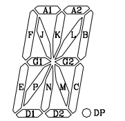
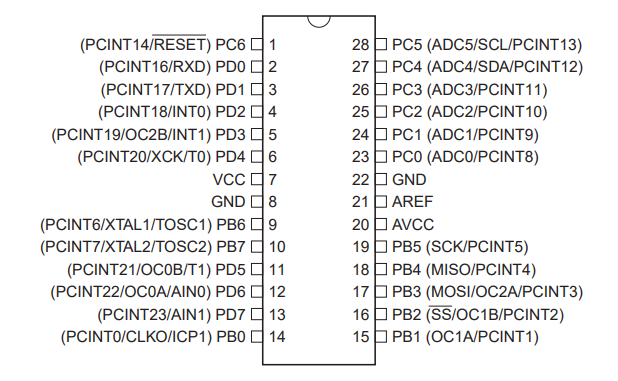

# Readme

## 問題名

electric noticeboard

## 分野

rev

## 難易度

medium

## 内容

次の能力を試されます

- 電子部品の仕様書の読み取り
  - マイコンのピンアサイン
  - 16セグメントLEDのピンアサイン
- C言語の読み取り
- マイコンのデジタルI/O割付

## 問題文

今日はクリスマス。彼女のためにサプライズで電光掲示板メッセージを流すことにした。商店街の人に[電光掲示板を動かすプログラム](./dist/sketch_dec24a/sketch_dec24a.ino)を渡した。電光掲示板には [A-2308SR](https://akizukidenshi.com/download/A-2308SR.pdf) と [atmega328](https://akizukidenshi.com/download/ds/microchip/atmega328.pdf) が使われているようだ。

※ フラグはすべて小文字です。

## フラグ

`imctf{we_will_continue_to_be_together}`

## WriteUp

1. `.ino`という拡張子から、AruduinoIDEのファイル形式であることが分かる。
1. [A-2308SR](https://akizukidenshi.com/download/A-2308SR.pdf)を見ると16segment LEDだと判明。
1. そのまま見ていると、16セグメントそれぞれに対応するアルファベットの接続端子があることが分かる。例えば、`A1`に電気を流すと一番左上が光る。
  
1. `.ino`ファイルの中で、アルファベットに対応している箇所を見つける。
1. 22行目を見ると、`pinMode(A1,OUTPUT);`となっている。
1. `Aruduino PinMode`などで検索すると、[PinModeのリファレンス](https://www.arduino.cc/reference/en/language/functions/digital-io/pinmode/)が見つかる。1行目の`int A1 = 2;`と合わせて、2番のピン（接続端子）をOutput（電気の出力）に設定していることが分かる。
1. [atmega328](https://akizukidenshi.com/download/ds/microchip/atmega328.pdf) を見ると、12ページ目にピン配列の図がある。

確かに、2番ピンは、Input/Outputを切換えできるPD0というピンであることが分かる。
1. 同様に確認していくと、それぞれ電気の出力端子とLEDのセグメントが１：１で対応していることが分かる。
1. 次に、loop関数は名前から、繰り返し実行されることが想像できる。
1. その中で、`TurnOn()`という関数が繰り返し実行されている。
1. `TurnOn()`は名前から、LEDを点灯しそうだと想像できる。
1. `TurnOn()`の中で繰り返し使われている `digitalWrite(A1, inA1 ? HIGH : LOW);` という部分に着目してみる。( `inA1 ? HIGH : LOW` は三項演算子)
1. `Arduino digitalWrite`で検索すると、[digitalWriteのリファレンス](https://www.arduino.cc/reference/en/language/functions/digital-io/digitalwrite/)が見つかる。ここで接続端子ごとに電圧の切換えをしていることが分かる。
1. `TurnOn()`の引数定義を見てみると、明らかにLEDのセグメントに対応するアルファベットが並んでいる。
1. 45~82行目にて、どこが`True`になっているのかが、そのまま点灯するLEDであると判明。
1. あとは、ひたすらどの`TurnOn()`が、フラグにおけるどの文字を表すのかを読み解く。
