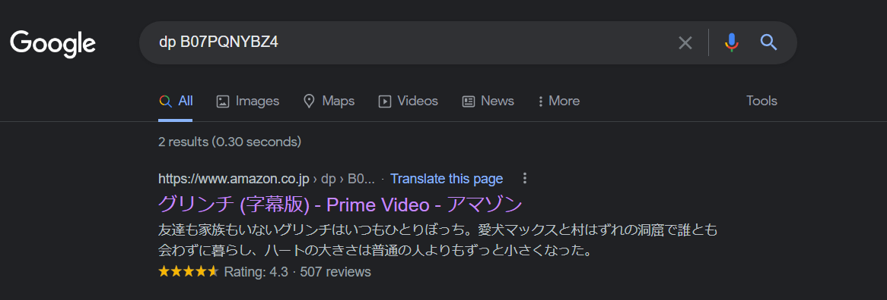
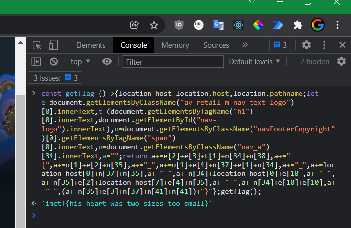

# Readme

## 問題名

no this site no life?

## 分野

rev & osint

## 難易度

nomal

## 内容

あるサイトの開発者コンソールに、このjsコードを実行するとフラグが出る。どのサイトなのかはヒントしかない。jsコードは、対象サイト上にで同じ場所に確実に存在し、かつ他のサイトでは同じ場所で見つからない文字を拾い、コラージュ文を作成するもの。

## 問題文

クリスマスが盗まれたらしい。緑の怪物がやりやがった。どうしてかって？知ったことか。取り返したいなら、このファイルを使いな！

[reson.js](./reason.js)

## ヒント

1. dp

## フラグ

`imctf{his_heart_was_two_sizes_too_small}`

## Writeup

1. ヒントを見ると`dp`とあり、配布ファイルのjs内を見ても、`dp`という変数が見つかります。
1. `dp`の値が`B07PQNYBZ4`なので、`dp B07PQNYBZ4`で検索してみます。

    

1. Amazon Prime のサイトでグリンチという映画がヒットします。このサイトを開きます。
1. chromeの開発者ツールを開き、consoleタブに配布ファイル内のjsを貼り付けて実行します。するとフラグが見つかります。

    
