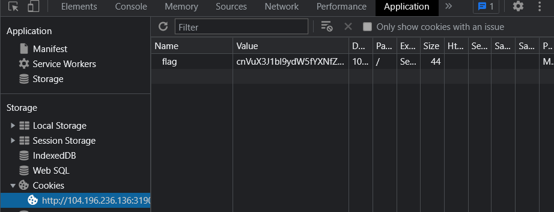

# Can you see 🍪?

## 問題名

can you see 🍪 ?

## 分野

web

## 難易度

easy

## 内容

- ブラウザの開発者ツールでクッキーをみたら答えが書いてある。
- 平文だと簡単過ぎるため、BASE64にして少し難易度を上げた。
- ~~クッキーの画像をチラつかせて視覚的なトリックかと惑わせる。~~

## 問題文

このクッキーが見えるか？

[http://104.196.236.136:31909/](http://104.196.236.136:31909/)

## フラグ

`imctf{run_run_run_as_fast_you_can!}`

## Writeup

1. chromeの開発者ツールで、Applicationタブを開いてみると、Cookieの項目で`flag`とある。

    

1. 取り出すとこんな感じ

    ```bash
    cnVuX3J1bl9ydW5fYXNfZmFzdF95b3VfY2FuIQ==
    ```

1. Base64のようなので、復号してみる。


## 作問

このフォルダ内で、下記コマンドを実行。compose V2 が前提条件。

```bash
sudo docker compose up -d --build
```
