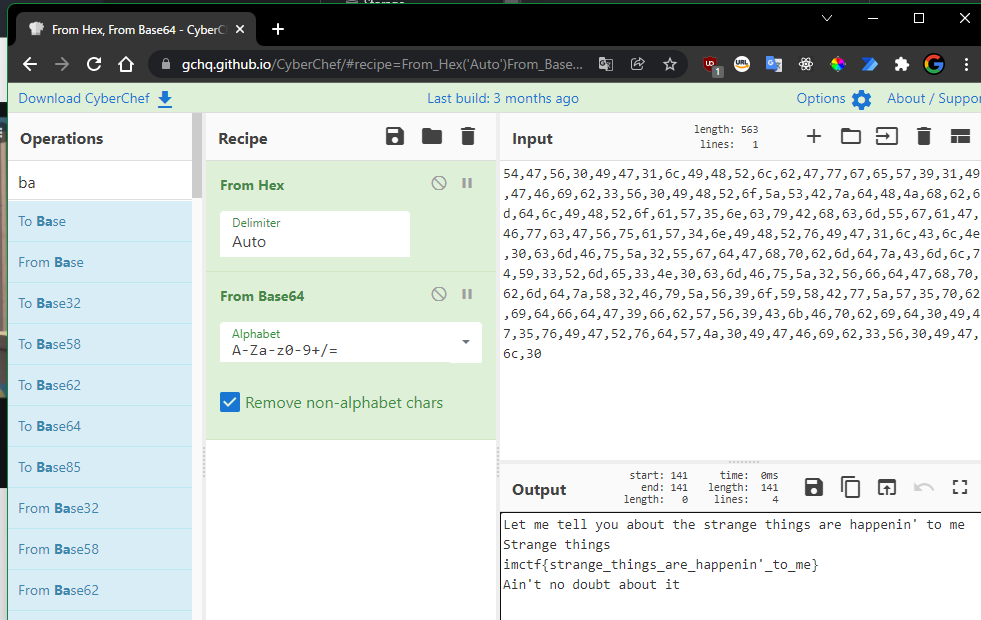
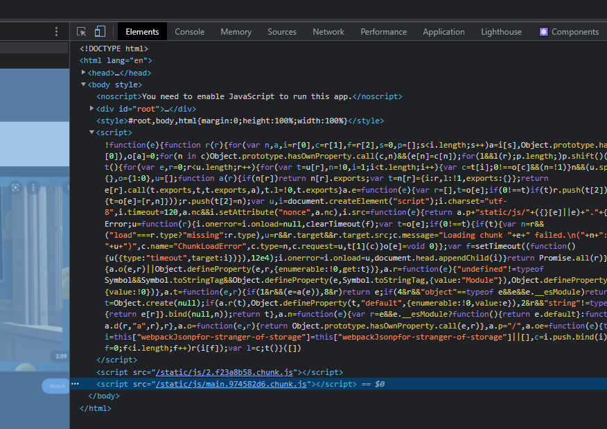
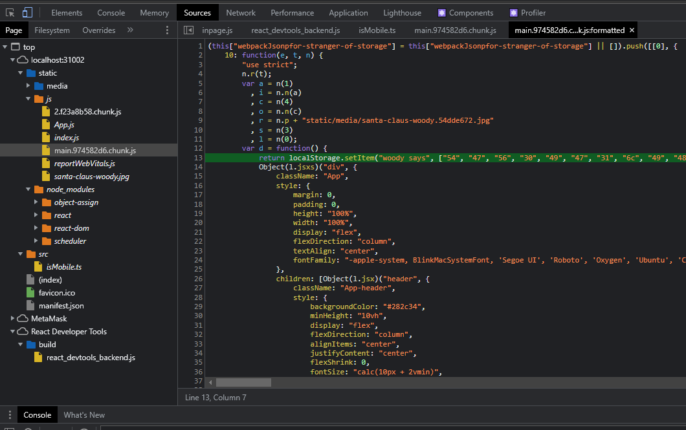

# for stranger of storage

## 問題名

for stranger of storage

## 分野

web

## 難易度

easy

## 内容

- ブラウザの開発者ツールでlocalstorageを見ると答えが書いてある。
- ソースから読み取れると非想定解なので難読化してある。

## 問題文

なんてこった！最悪だぜ！まさかそんなとこに置き忘れるなんて！

[http://104.196.236.136:31002/](http://104.196.236.136:31002/)

## フラグ

`imctf{strange_things_are_happenin'_to_me}`

## Writeup

解法1

1. Chromeなどの開発者ツールでウッディーがなんか言ってる

1. CyberChefなどで解読するとフラグ


解法2

1. chromeなどの開発者ツールで、ソースを見つける。

1. 見てみると、ウッディーが何か話している見たい。

1. 解法１と同様に解読

## 作問

このフォルダ内で、下記コマンドを実行。compose V2 が前提条件。

```bash
sudo docker compose up -d --build
```
