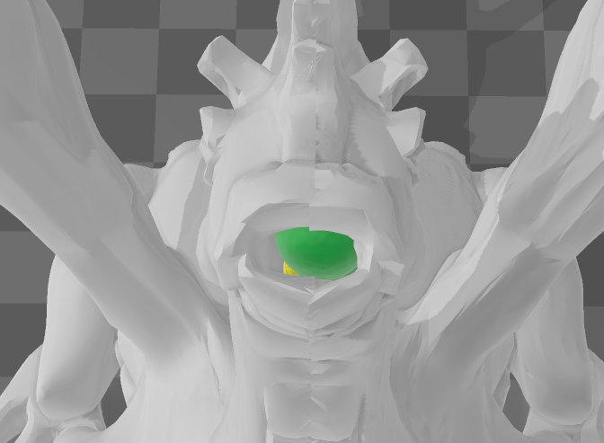
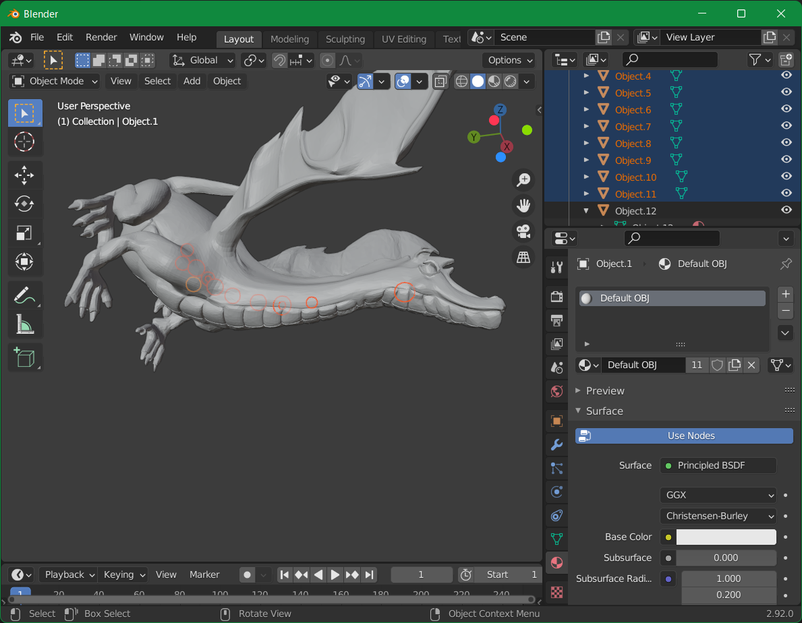

# Knight CTF

## The Hungry Dragon

1. Microsoftの[3D Builder](https://www.microsoft.com/store/productId/9WZDNCRFJ3T6)で開いてみた

1. なんか丸いのがある
1. 拡張子をobjにしてエクスポート
1. Blenderでインポート
1. オブジェクトツリーで触るとハイライトされる
1. フラグの形式が`KCTF{5_doughnut_and_5_sweet}`なので、`KCTF{2_doughnut_and_9_sweet}`

