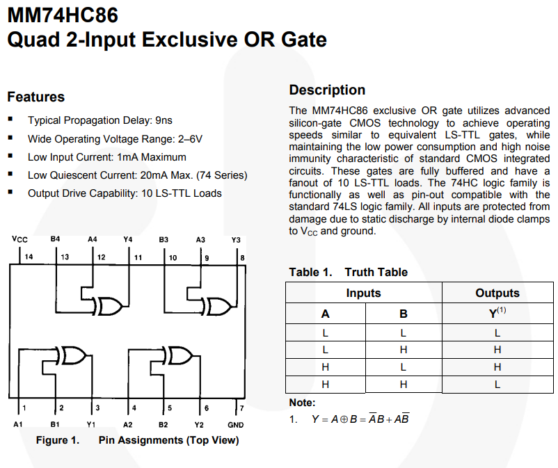

# Writeup

1. read `source.ino`.
    - Output1 is binary of most right digit, and output4 is binary of most left digit.
1. read `setup.jpg` and `skech.pdf`
1. search `MM74HC86N`
    - <https://www.mouser.jp/datasheet/2/308/1/MM74HC86_D-2315791.pdf>
    - 
1. resolve relation
    - (output1 = 53) $\oplus$ L --> (29 = input1)
    - (output2 = 51) $\oplus$ L --> (27 = input2)
    - (output3 = 49) $\oplus$ L --> (25 = input3)
    - (output4 = 47) $\oplus$ L --> (23 = input4)
1. At Last, Solve By [CyberChef](https://gchq.github.io/CyberChef/#recipe=From_Binary('Line%20feed',8)To_Hex('CRLF',0/disabled)XOR(%7B'option':'Binary','string':'01010101'%7D,'Standard',false)Find_/_Replace(%7B'option':'Regex','string':'%5C%5Cn'%7D,'',true,false,true,false/disabled)&input=MDAxMTAwMTEKMDAxMTEwMDEKMDAxMTAxMDAKMDAxMTAwMTAKMDAxMDExMTAKMDAxMTAxMDAKMDExMDAxMDAKMDExMDAwMTEKMDAxMTAxMTEKMDExMDExMDEKMDExMDAxMDEKMDExMDAxMTEKMDExMDAwMTAKMDAxMTAxMTAKMDAxMTAwMTEKMDExMDAxMTAKMDExMDAwMTAKMDExMDAwMDEKMDAxMTAxMTEKMDExMDAxMDAKMDExMDAxMDAKMDExMDAwMDAKMDAxMTAwMTEKMDExMDAwMTAKMDAxMTAxMTAKMDExMDAxMTAKMDAxMTAwMDAKMDExMDAxMTEKMDAxMTAwMTEKMDExMDAwMTEKMDExMDAxMTEKMDExMDAxMTEKMDAxMTAwMDEKMDExMDExMDEKMDExMDAwMDEKMDAxMTAxMTEKMDAxMTAxMTAKMDAxMDEwMDA).
